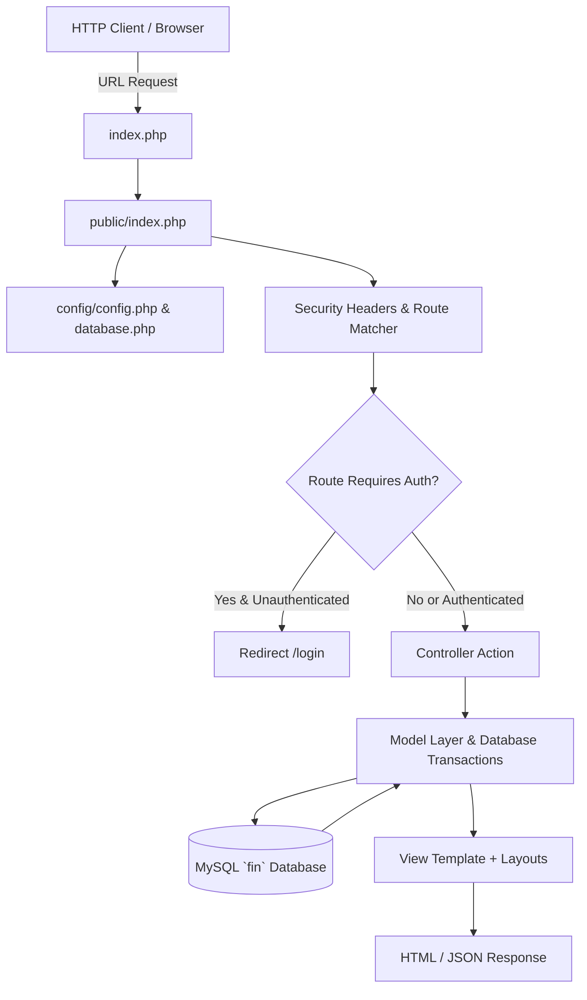
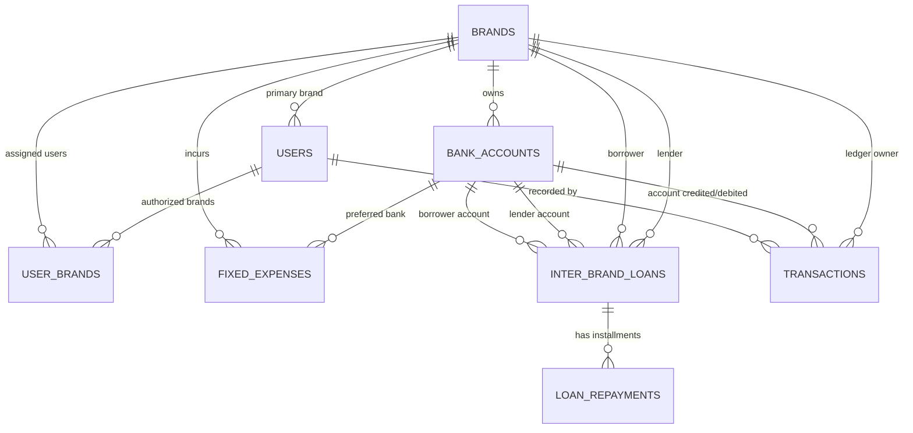
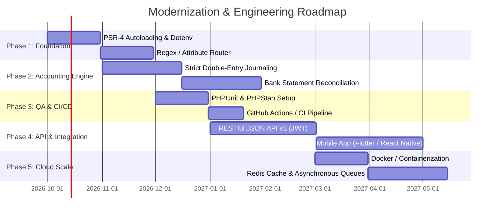

# Biswas Fin — System Architecture & Future Development Roadmap

> **Document Version:** 1.0  
> **Last Updated:** September 2026  
> **Status:** Active Reference Architecture  
> **Target Audience:** Engineering Leads, Full-Stack Developers, DevOps, System Administrators

---

## 1. Executive Summary

**Biswas Fin (Multi-Brand Finance System)** is a consolidated multi-entity financial management portal. It enables unified financial management, cashflow tracking, inter-company lending, recurring expense management, and ledger auditing across multiple brands (e.g., *Legal Bengal, Biswas Company, Go 2 AI School, Banglar Server, Dot Papa, Zweilo, Inkam Project, Larnity*).

### Primary System Objectives
- **Data Segregation & Unified Oversight**: Granular brand-level isolation for brand operators alongside consolidated group dashboards for Super Administrators and Managers.
- **Double-Entry Inter-Brand Loans**: Automated dual transaction generation (Money Out / Money In) when sister entities lend or repay funds.
- **Fixed Monthly Expense Automation**: Automated tracking, payment recording, and scheduled email alerts for recurring overheads (salaries, servers, rent, domains).
- **High Performance & Low Overhead**: Native PHP 8 architecture without heavy external framework bloat, optimized for low resource footprint in XAMPP/Apache environments.

---

## 2. Current Architecture & Technology Stack

### 2.1 Tech Stack Matrix

| Layer | Component | Description |
| :--- | :--- | :--- |
| **Runtime** | PHP 8.2+ | Native strict-type scripting, zero external runtime framework dependencies |
| **Web Server** | Apache 2.4 | URL rewriting configured via [.htaccess](file:///c:/xampp/htdocs/fin/.htaccess) and [public/index.php](file:///c:/xampp/htdocs/fin/public/index.php) |
| **Database** | MySQL / MariaDB (InnoDB) | UTF8mb4 character set, foreign keys, prepared PDO transactions |
| **Frontend Styling**| Tailwind CSS (CDN) | Modern utility-first CSS layout with responsive typography |
| **Iconography & UI**| FontAwesome 6 + SweetAlert2 | Interactive modals, alert toasts, and visual cues |
| **Mobile / PWA** | Progressive Web App | [manifest.json](file:///c:/xampp/htdocs/fin/public/manifest.json) & [sw.js](file:///c:/xampp/htdocs/fin/public/sw.js) Service Worker for mobile caching |
| **Mail Engine** | Native Socket SMTP | Custom raw socket TLS/SSL implementation in [Mailer.php](file:///c:/xampp/htdocs/fin/app/Helpers/Mailer.php) |

---

### 2.2 Directory Structure

```
c:/xampp/htdocs/fin/
├── app/
│   ├── Controllers/             # HTTP request handlers and response orchestrators
│   │   ├── AuthController.php
│   │   ├── BankAccountController.php
│   │   ├── BankTransferController.php
│   │   ├── BrandController.php
│   │   ├── DashboardController.php
│   │   ├── DirectoryController.php
│   │   ├── ExpenseController.php
│   │   ├── FixedExpenseController.php
│   │   ├── LiabilityController.php
│   │   ├── LoanController.php
│   │   ├── MoneyInController.php
│   │   ├── ProfileController.php
│   │   ├── ReceivableController.php
│   │   ├── RepaymentController.php
│   │   ├── ReportController.php
│   │   ├── SettingController.php
│   │   ├── TransactionController.php
│   │   └── UserController.php
│   │
│   ├── Helpers/                 # Shared utilities and security abstractions
│   │   ├── Auth.php             # Session authentication, RBAC, Brand access rules
│   │   ├── CsvExporter.php      # Streaming CSV report generation
│   │   ├── Flash.php            # Flash messaging session store
│   │   ├── Format.php           # Currency (₹ INR), date, brand logo formatters
│   │   ├── Mailer.php           # Raw TLS/SSL socket SMTP client
│   │   ├── Pagination.php       # Universal pagination & query string preserver
│   │   ├── Security.php         # CSRF validation, XSS escaping, account masking
│   │   └── Upload.php           # Secure image upload helper
│   │
│   └── Models/                  # Database access layer (PDO prepared statements)
│       ├── BankAccount.php
│       ├── Brand.php
│       ├── FixedExpense.php
│       ├── Loan.php
│       ├── LoanRepayment.php
│       ├── Report.php
│       ├── Setting.php
│       ├── Transaction.php
│       └── User.php
│
├── bin/
│   └── send_fixed_expense_notifications.php # CLI cron script for email dispatch
├── config/
│   ├── config.php               # Environment constants, paths, database credentials
│   ├── config.sample.php        # Sample config template for deployments
│   └── database.php             # Singleton PDO database connector
├── database/
│   └── schema.sql               # Complete SQL schema definition
├── public/
│   ├── index.php                # Front controller and central router
│   ├── manifest.json            # PWA manifest
│   ├── sw.js                    # Service worker
│   ├── pwa-icon.php             # Dynamic SVG/PNG icon generator
│   └── api/
│       └── bank-accounts.php    # JSON API endpoint for dynamic dropdowns
└── views/                       # Modular presentation layer
    ├── auth/                    # Login screens
    ├── bank_accounts/           # Bank account CRUD
    ├── bank_transfers/          # Bank to bank fund transfer
    ├── brands/                  # Brand management
    ├── dashboard/               # Group & Brand analytical dashboards
    ├── directory/               # Group company profiles & contact directory
    ├── expenses/                # Quick Money Out recording
    ├── fixed_expenses/          # Recurring expense management & one-click pay
    ├── layouts/                 # Header, Footer, Sidebar, Topbar, Alerts
    ├── liabilities/             # Consolidated borrowings & dues
    ├── loans/                   # Inter-brand loan origination & details
    ├── money_in/                # Quick Money In recording
    ├── profile/                 # User personal profile & password updater
    ├── receivables/             # Consolidated lendings & dues
    ├── repayments/              # Loan repayment installments
    ├── reports/                 # Daily, monthly, brand & loan reports
    ├── settings/                # SMTP & system configurations
    ├── transactions/            # Ledger audit trail with multi-filter bar
    └── users/                   # System user CRUD & brand assignments
```

---

### 2.3 Request Lifecycle & Routing Architecture

All incoming web requests are intercepted by Apache `.htaccess` and forwarded to [public/index.php](file:///c:/xampp/htdocs/fin/public/index.php):



---

### 2.4 Entity-Relationship Diagram (ERD)



---

### 2.5 Role-Based Access Control (RBAC) Matrix

| Feature / Resource | `super_admin` | `brand_user` | `manager` |
| :--- | :---: | :---: | :---: |
| **Group Dashboard Overview** | Full Access | ❌ Restricted | Read-Only |
| **Brand Dashboard** | All Brands | Assigned Brands Only | All Brands (Read-Only) |
| **Record Money In / Expense** | Full Access | Assigned Brands Only | ❌ Restricted |
| **Bank to Bank Transfer** | ❌ Restricted | Assigned Brands Only | ❌ Restricted |
| **Manage Fixed Expenses** | Full Access | Assigned Brands Only | Read-Only |
| **Issue Inter-Brand Loans** | Full Access | Assigned Brands Only | ❌ Restricted |
| **Execute Loan Repayments** | Full Access | Assigned Brands Only | ❌ Restricted |
| **Edit / Delete Transactions**| Full Access | Assigned Brands Only | ❌ Restricted |
| **Brand Master Management** | Full Access | ❌ Restricted | Read-Only |
| **User & Access Management** | Full Access | ❌ Restricted | ❌ Restricted |
| **System & SMTP Settings** | Full Access | ❌ Restricted | ❌ Restricted |
| **Export Financial CSVs** | Full Access | Assigned Brands Only | Full Access |

---

## 3. Current System Strengths & Engineering Analysis

### Strengths
1. **Lightweight & High Speed**: Extremely fast cold start and low memory consumption (< 4MB per request) due to zero bulky framework dependencies.
2. **Double-Entry Loan Integrity**: Automated bilateral transaction recording prevents discrepancies between borrower and lender ledgers.
3. **Dynamic Balance Calculation**: Bank account balances are computed on-the-fly from the initial balance plus sum of signed transactions, preventing drift caused by stale cached fields.
4. **Resilient Native SMTP Mailer**: Bypasses external Composer dependencies with a custom TCP socket implementation supporting TLS/STARTTLS authentication.
5. **Robust Audit Trail & Filter System**: Transaction ledger supports real-time multi-dimensional filtering across Brand, Type, Category, Bank Account, Amount ranges, Free-text Search, and Date-to-Date presets.

### Technical Debt to Address
1. **Manual File Require Statements**: [public/index.php](file:///c:/xampp/htdocs/fin/public/index.php) includes 25+ explicit `require_once` statements instead of a PSR-4 autoloader.
2. **Hardcoded Routing Tree**: If/elseif ladder router in [public/index.php](file:///c:/xampp/htdocs/fin/public/index.php) scales linearly with route count.
3. **Database Credentials in PHP Files**: Sensitive database credentials reside in [config/config.php](file:///c:/xampp/htdocs/fin/config/config.php) rather than an ignored `.env` file.
4. **Lack of Automated Unit / Integration Tests**: No automated test suites for financial balance calculations or loan repayment state machine.

---

## 4. Future Architecture & Development Roadmap



### Phase 1: Architecture Modernization (Near-Term)
- **PSR-4 Autoloading**: Implement Composer-based or native zero-dependency PSR-4 autoloader mapping `App\` namespaces directly to directory paths.
- **Environment Configuration (.env)**: Move secrets (DB credentials, SMTP keys, App secrets) to a gitignored `.env` file loaded via a lightweight dotenv parser.
- **Declarative Router**: Replace the current `if/elseif` block with a compiled array/regex routing engine supporting HTTP method matching, middleware stacks, and named parameters.

### Phase 2: Advanced Accounting & Financial Controls
- **Full Double-Entry Journal Structure**:
  - Introduce `journal_entries` and `journal_items` (debit/credit lines) backing every transaction.
  - Implement ledger closing periods (lock previous fiscal months against modifications).
- **Bank Statement Reconciliation**:
  - CSV upload parser to compare bank statements against system records with matching suggestions.
- **Multi-Currency Support**:
  - Exchange rate lookup table for brands transacting in USD, EUR, or BDT alongside INR.

### Phase 3: Quality Assurance & Automated Testing
- **Static Analysis**: Integrate **PHPStan** (level 8) to catch type errors and potential null pointer dereferences before runtime.
- **Unit & Integration Test Suite**: Implement **PHPUnit** suites covering:
  - Bank balance calculations under concurrent transactions.
  - Loan repayment state transitions (`active` -> `partially_repaid` -> `paid`).
  - Permission boundaries for multi-brand user scopes.

### Phase 4: RESTful API & Mobile Expansion
- **API Version 1 (`/api/v1/`)**:
  - Stateless JSON endpoints secured by JWT (JSON Web Tokens) or HMAC API keys.
  - Endpoints for mobile expense capture, balance inquiries, and fast Money In receipts.
- **Push Notification Integration**:
  - WebPush / Firebase Cloud Messaging (FCM) integration for real-time mobile alerts on loan approvals and overdue fixed expenses.

### Phase 5: Infrastructure & Cloud Scalability
- **Dockerization**: Provide `docker-compose.yml` defining isolated PHP-FPM, Nginx, MariaDB, and Mailpit (local SMTP debugging) containers.
- **Asynchronous Background Worker**: Move email notifications and PDF/CSV bulk generations to a background queue worker (Redis or database-backed queue) instead of blocking web workers.

---

## 5. Developer Onboarding & Local Setup

### Prerequisites
- PHP 8.2 or higher
- MySQL 8.0+ or MariaDB 10.4+
- Apache Web Server (or Nginx with PHP-FPM) with `mod_rewrite` enabled

### Setup Instructions
1. **Clone repository**:
   ```bash
   git clone <repo-url> c:/xampp/htdocs/fin
   ```
2. **Database Import**:
   - Create database in MySQL:
     ```sql
     CREATE DATABASE `fin` CHARACTER SET utf8mb4 COLLATE utf8mb4_unicode_ci;
     ```
   - Import initial schema:
     ```bash
     mysql -u root -p fin < database/schema.sql
     ```
3. **Configuration**:
   - Verify credentials in [config/config.php](file:///c:/xampp/htdocs/fin/config/config.php):
     ```php
     define('DB_HOST', 'localhost');
     define('DB_PORT', '3306');
     define('DB_NAME', 'fin');
     define('DB_USER', 'root');
     define('DB_PASS', '');
     ```
4. **Access System**:
   - Navigate to `http://localhost/fin`
   - Log in using your designated administrative account.

---

## 6. Coding Standards & Conventions

1. **Security First**:
   - Always sanitize output using `e()` helper: `<?= e($value) ?>`.
   - Always verify CSRF tokens for all state-changing POST requests using `Security::verifyCsrf()`.
   - Always enforce brand authorization checks before data mutations using `Auth::authorizeBrandModification($brandId)`.
2. **Database Queries**:
   - Never concatenate raw variables into SQL queries. Always use PDO parameterized queries:
     ```php
     $stmt = $db->prepare("SELECT * FROM transactions WHERE brand_id = ?");
     $stmt->execute([$brandId]);
     ```
3. **Transactions**:
   - Wrap multi-table operations (e.g. loans, repayments, user deletions) in `$db->beginTransaction()` and `$db->commit()` inside a `try / catch` block with `$db->rollBack()`.
4. **UI Consistency**:
   - Use predefined Tailwind design tokens (`brand-*`, `slate-*`, `emerald-*`, `rose-*`).
   - Use FontAwesome 6 icons consistently with existing modules.
